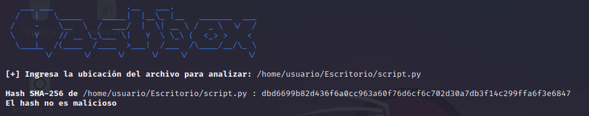

## hashbox

<p align="center">

</p>

hashbox es una herramienta que nos sirve para saber si un programa es malicioso a partir del hash y comparándola con la lista de hashes más peligrosos, la lista contiene mas 1000 000 hashes.

```
git clone https://github.com/bl4ck44/hashbox.git

cd hashbox

python3 hashbox.py
```

<p align="center">

</p>